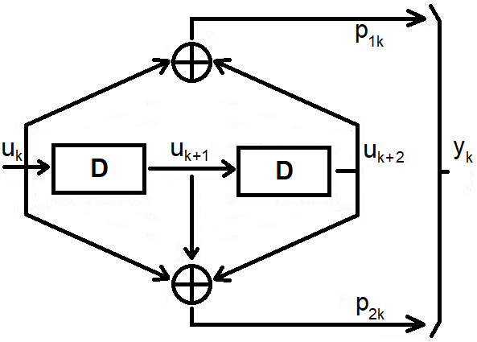
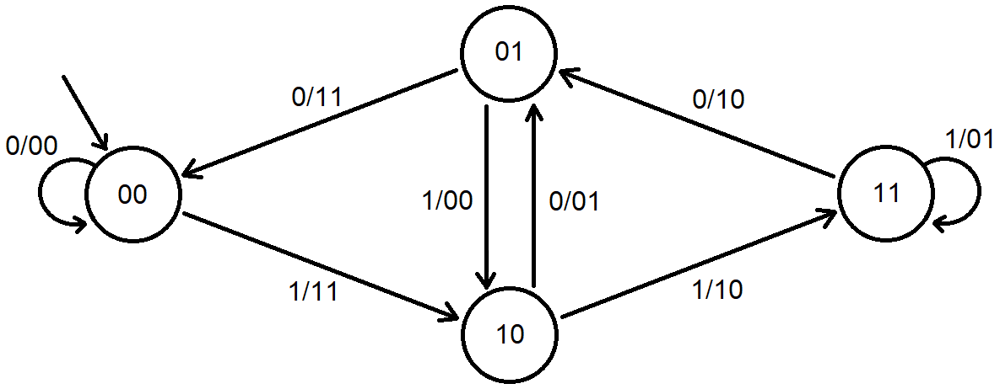

<h1>Digital Circuit Design Project</h1>

[![License: MIT][license-image]][license]

This is the final test of "**Reti Logiche**", course of "**Computer Engineering**" held at Politecnico di Milano (2021/2022).

**Professor**: William Fornaciari

**Final Score**: 30 cum laude / 30

<h2>Goal</h2>

Given a sequence of N words, each of 8 bits, and size N, the purpose of the project is to implement an hardware module, described in VHDL, that interfaces with a memory and provide the 2N words computed by a convolutional encoder.

<h2>Specifications</h2>

The module receives as input a continuous sequence of W words, each of 8 bits, and returns as output a continuous sequence of Z-words, each of 8 bits. Each of the input words input is serialized, so a continuous stream U of 1 bit is generated.

On this stream the convolutional code 1/2 is applied
(each bit is encoded with 2 bits) according to the scheme shown in the figure; this operation generates a stream as output
continuous Y stream. The Y stream is obtained as an alternating chaining of the two output bits.

The output sequence Z is the parallelization, over 8 bits, of the continuous stream Y.

<h2>Copyright and license</h2>

This project is copyright 2022.

Licensed under the **[MIT License][license]**; you may not use this software except in compliance with the License.

[license]: https://github.com/christian-confalonieri/Convolutional-Encoder-Prova-Finale-Reti-Logiche-2021-2022/blob/main/LICENSE
[license-image]: https://img.shields.io/badge/License-MIT-blue.svg